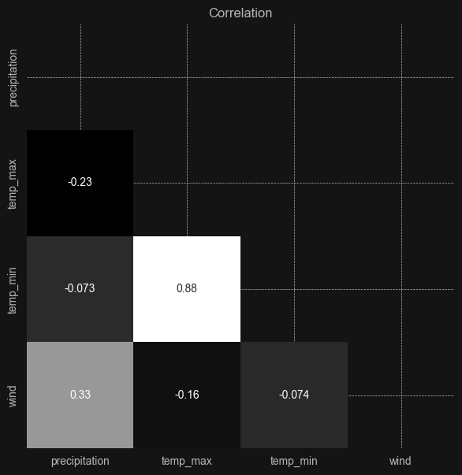

# { Introduction }
In this small project we will take a look at Seattle weather dataset from Kaggle to extract important features and use them to test functionality of Recurrent Neural Network.
  

### Libraries I've used:
- ***tensorflow, keras, sklearn*** for machine learning
- ***numpy, scipy, random*** for numerical and statistical operations
- ***matplotlib, seaborn*** for data visualization

### The full process includes:
1) **Data exploration**
   - Overview
   - Anomalies
   - Visualization
   - Preparing data for model
   - Skull size
   - Class weights
   - Feature scaling

2) **Building model**
   - Train / test split
   - Sequencing datasets
   - Class LSTM
   - Training function
   - Testing function
   - Training and Testing the RNN models

3) **Conclusion**

# { Extracted features }

### Average temperature
The maximum and minimum temperature series changes over time with a very stable vertical shift.  
Basing on this strong correlation I've decided to replace them with _**average temperature**_ which is basically mean value of these two series.  
This reduced the number of values fed into the model in the calculations resulting with more efficient training.

# { Summary }

### What I achieved:
- I learned a lot about recurrent neural networks and how to work with time series data
- LSTM model that recognizes patterns within time series data

### Future ideas:
- Remove chaotic data and compare new results with previous predictions.
- Apply Granger causality
