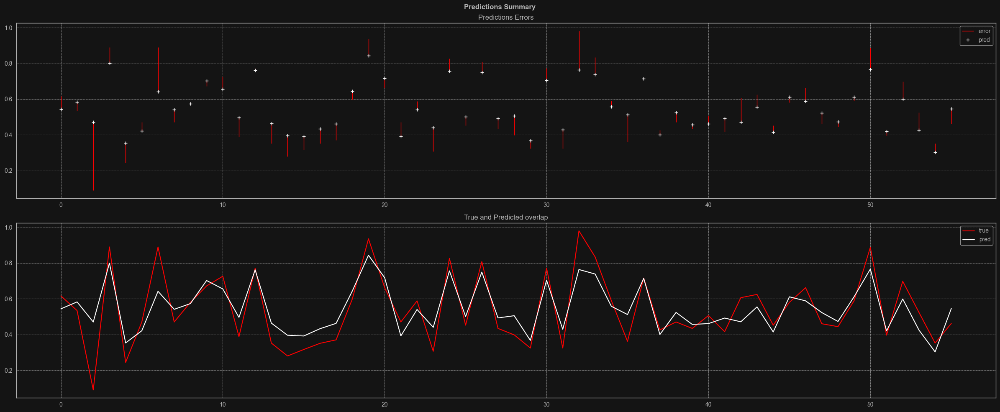
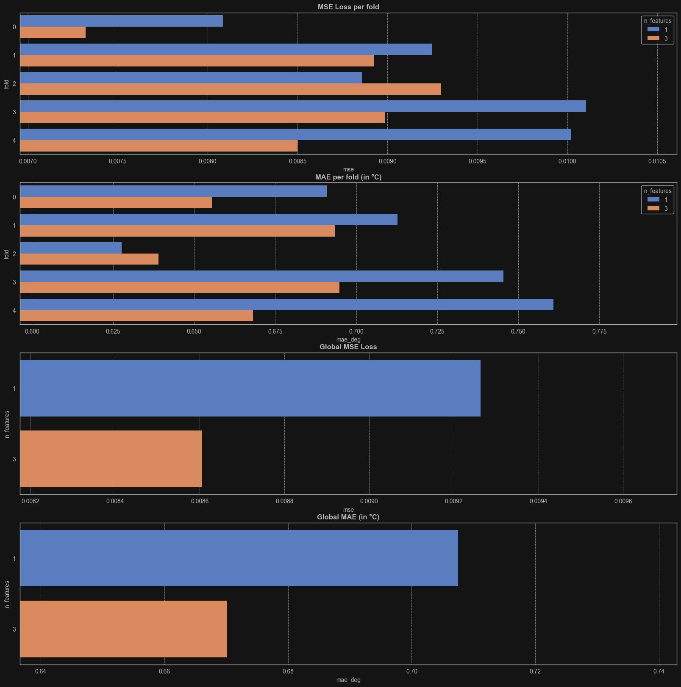

# { Introduction }
In this small project I've touched on Seattle weather dataset from Kaggle to extract important features
and use them to test functionality of Recurrent Neural Network.
### Libraries I've used:
- ***torch, sklearn*** for machine learning
- ***pandas*** for data manipulation and analysis
- ***numpy, scipy, statsmodels*** for numerical and statistical operations
- ***matplotlib, seaborn*** for data visualization

### The full process includes:
1) **Data exploration**
   - Overview
   - Visualization
   - Data seasonality
   - Granger causality

2) **Preparing dataset**
   - Load data
   - Feature scaling
   - Train / test split
   - Data loader

3) **Building model**
   - Class RNN
   - Training
   - Testing
   - Second model
   - Cross-validation (single & multiple features)
   - Model comparison

4) **Conclusion**

# { Insights }

### Average temperature

The maximum and minimum temperature series changes over time with a very stable vertical shift.  
Basing on this strong correlation, _**maximum temperature**_ and _**minimum temperature**_ has been swapped with _**average temperature**_.  
This reduced the number of values fed into the model in the calculations resulting with more efficient training.

### Weather condition balance

### Features

Despite Granger causality test is mainly used for linear models, it shows interesting information about features.  
Although the trend was kind of similar for both features, the precipitation was way above 0.05 threshold,  
this indicated a low predictive impact for average temperature feature prediction.  

The model has been tested within different configurations.  
First configuration contained one feature (average temperature),  
in second configuration wind and precipitation features has been added  
to see if it actually helps in predicting average temperature.

# { Summary }

### Prediction errors

White '+' marks indicates the predicted values returned by model.  
The red lines in the first plot indicate the deviation of the error from the true values.
### Cross-validation

First plot contains scoring per fold. While second one is mean of all folds per model.

Models have been tested with different parameter combinations like, _hidden_size_, _batch_size_ and sequence_length).  
Every time the model that used 3 features had slightly lower loss and error.  
It turned out that using model with 3 features results in better accuracy of predicting average temperature.  
Overall I think this project gives quiet simple fundamentals to understand the functionality of Recurrent Neural Networks.